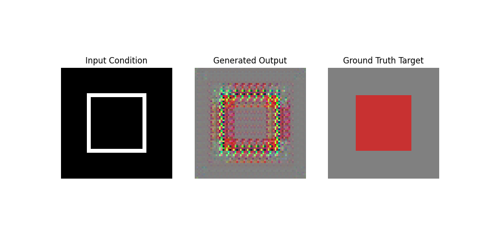

# PRODIGY_GA_04: Image-to-Image Translation using pix2pix cGAN

This repository contains my official final submission for **Task 4** of my Generative AI Internship at Prodigy InfoTech.

🚀 Project Overview
The objective of this task is to implement a **Conditional Generative Adversarial Network (cGAN)** based on the standard *pix2pix* architecture to execute paired Image-to-Image translation tasks.

📊 Evaluation Metrics & Visualization
Below is the output generated by the model comparison matrix:

🧠 Theory Learned
- **Conditional Adversarial Mechanics:** Unlike classical GANs that map from arbitrary noise space vectors ($z$), a cGAN conditions both the Generator and the Discriminator on an auxiliary input image ($x$), forcing structural consistency.
- **L1 Pixel-Level Loss Penalty:** The objective function combines a binary cross-entropy loss with an L1 regularization term ($||y - G(x, z)||_1$). This forces the generator to capture low-frequency structural details alongside realistic high-frequency features.
- **Encoder-Decoder Architectures:** Exploring bottleneck patterns where deep layers extract contextual features before decoding them back to target image dimensions.

🛠️ Technology Stack
- Python 3
- PyTorch & Torchvision
- Matplotlib
- Google Colab (T4 GPU Accelerated Runtime)
